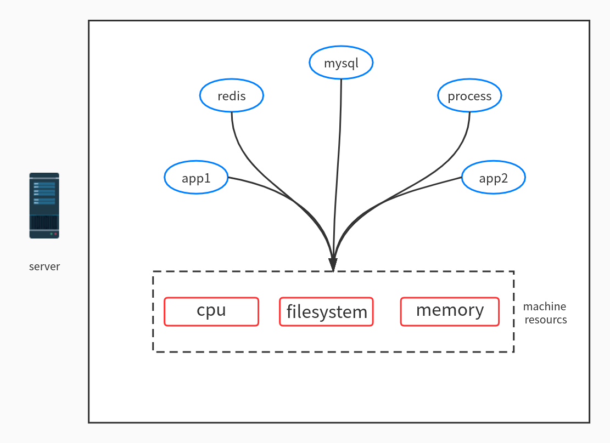
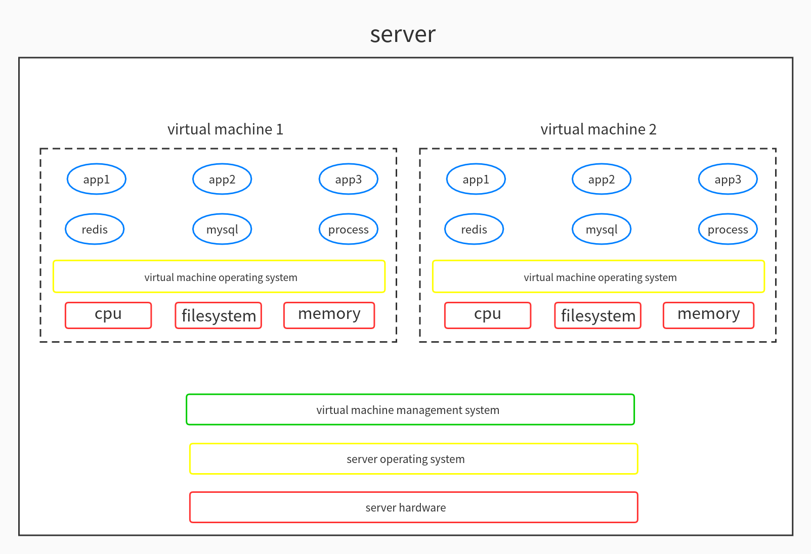
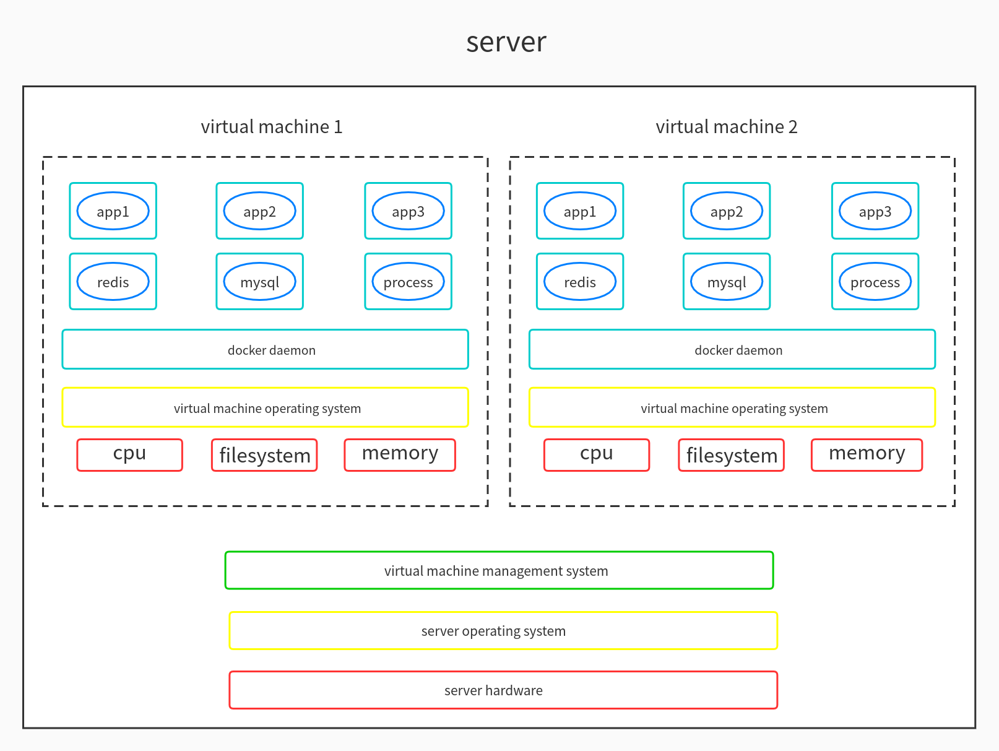
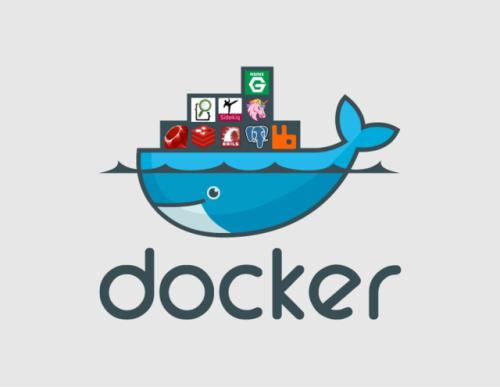

# 容器技术与DevOps的关系
```text
去年是高速发展的一年，由于我们有很多新成员的加入，我们的很多开发,测试,运维人员对于在我们DevOps生命周期中各种技术扮演的角色是不够了解的，所以我现在想就这一块大家存在的短板做整体的提升。

这里主要是讲解容器技术与DevOps的关系，这门技术在我们DevOps生命周期中扮演的角色，由于我们现阶段使用的是Docker，这里主要讲解Docker。
```

## 服务部署之容器技术

#### 从服务部署的前后今生
```text
1. 物理机部署时代
用纯粹的物理机部署应用，这是所有早期互联网公司经历的一个阶段。一台大型的服务器，如果只部署一个应用，资源比较浪费。
那么我们，将多个应用进程，DB，缓存进程等等都部署在同一个机器上，这样部署能高效的利用好昂贵的物理机，但是这种简单粗暴的方式有一个最大的痛点：进程间资源抢占。
举若干栗子: 
   如果某个进程耗用了100%的CPU资源，那么其他的进程无法提供服务。
   如果一个进程因为突发异常很多，日志把磁盘打满了，那么所有的进程都要挂掉。
对于资源共享时进程间的资源竞争，比较好的解决方式就是：进程间硬件资源隔离，虚拟机技术的出现解决了这个棘手的问题。
```



```text
2. 虚拟机部署时代
虚拟机通过硬件虚拟化，即每台虚拟机事先从物理机分配好cpu核数，内存， 磁盘，每台虚拟机一般只部署一个应用。从而解决了进程间资源隔离的问题。
不同的进程在不同的虚拟机上跑，大家相安无事，自然没有资源冲突。一台物理机会部署多台虚拟机，物理机里的所有虚拟机则依靠虚拟机管理系统进行管理。
虚拟机技术解决了物理机部署的痛点。但是虚拟机并不是完美的，他也有自己的缺点。
  a.大集群部署情况下，软件的版本容易混乱。
    大应用集群的虚拟机第一次安装时，由于操作系统镜像是一样的，所以刚开始，软件的版本和库依赖是统一的。
    随着时间的推移，开源的软件（tomcat, jdk, nginx）需要逐步升级，于是运维同学开始批量升级集群的软件版本，批量升级可能有遗漏或升级失败。
  b.同时有些开发同学会自己登陆机器修改软件的版本或者配置，以满足自己的需求。
    长此以往，一个应用的集群的虚拟机的软件版本和配置逐渐碎片化，当线上出现问题，需要排查到基础软件层面时，由于软件版本碎片化的问题，导致排查变得很棘手。
为了解决虚拟机部署的痛点，容器技术应运而生。
```



```text
3. 容器部署时代
容器技术不仅限于docker，但是docker目前最为流行，我以docker为例讲容器。
docker容器技术的核心之一在于镜像文件。
镜像文件，通俗的理解就是一个进程运行时依赖的软件文件的集装箱。
应用集群部署时，每台机器首先会拉取指定版本的镜像文件。安装镜像后产生了docker容器。由于所有机器的镜像文件一样，容器的软件版本故而一样。即使开发或运维中途修改了容器的软件版本，但是容器销毁时，软件的改动会随容器的销毁一起湮灭。
容器如果要升级软件版本，那就修改镜像文件。这样部署时集群内所有的机器重新拉取新的镜像，软件因此跟着一起升级。软件版本混乱的问题，到docker这里，也就得到了完美的解决。
```


## Docker简介
```text
Docker 是一个开源的应用容器引擎，基于Go语言并遵从Apache2.0协议开源，是一个开放平台，用于开发应用、交付（shipping）应用、运行应用。
Docker允许用户将基础设施（Infrastructure）中的应用单独分割出来，形成更小的颗粒（容器），从而提高交付软件的速度。
Docker容器与虚拟机类似，但二者在原理上不同。容器是将操作系统层虚拟化，虚拟机则是虚拟化硬件，因此容器更具有便携性、高效地利用服务器。
Docker利用Linux核心中的资源分离机制，例如cgroups，以及Linux核心命名空间（namespaces）等来建立独立的容器（containers），它可以在单一Linux实体下运作，避免启动一个虚拟机器造成的额外负担。
Linux核心对命名空间的支援完全隔离了工作环境中应用程序的视野，包括进程树、网络、用户ID与文件挂载档案系统，而核心的cgroup提供资源隔离，包括CPU、内存、磁盘I/O与网络。
```



#### Docker在公司起的作用
```text
1. 镜像仓库
2. 服务部署
```

#### Docker与开发/测试/运维的关系
```text
前端/后端/测试/运维的同学推送代码至gitlab代码仓库，触发gitlab-ci，经过代码校验检查与build，构建镜像并推送至开发测试环境镜像仓库。
构建失败需要检查各个环节，检查修改后重新推送。
```

#### Docker与线上生产Kubernetes集群关系
```text
为了高效地进行监控各个容器的健康运行情况以及崩溃后如何迁移服务，做集群编排管理，出现了docker swarm技术，是docker自家的技术。
但是Google接着就开源了其内部用了很久的容器治理编排工具Kubernetes，以其高效以及智能自动化的管理机制，吸引了大批开源开发者以及公司的青睐，从此一战成名。
后面会继续分享Kubernetes相关的知识点。
生产Kubernetes现在是在使用docker的镜像仓库功能。
```

## 干货,演示环节
```text
指路====> https://github.com/Min65535/demo/tree/master/dfm-test/docker
备用====> https://gitee.com/min65535/demo/tree/master/dfm-test/docker
```

## 提问与解答环节
```text
一个疑问：有了容器技术，生产环境为何还需要部署虚拟机？
  虚拟机能做到硬件资源的彻底隔离，docker不行。虚拟机和docker各取长处，最佳CP。
```