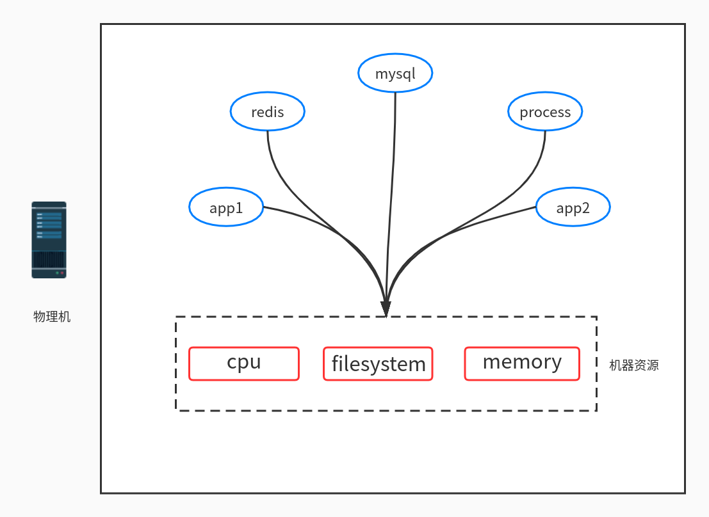

# Docker与DevOps的关系
```text
去年是高速发展的一年，由于我们有很多新成员的加入，我们的很多开发,测试,运维人员对于在我们DevOps生命周期中各种技术扮演的角色是不够了解的，所以我现在想就这一块大家存在的短板做整体的提升。

这里主要是讲解Docker与DevOps的关系，这门技术在我们DevOps生命周期中扮演的角色。

KVM技术的发展，解放了单台服务器物理机的资源过剩的浪费，虚拟机的资源互相独立，部署应用不受影响，但缺点是占用资源多，有安全补丁更新时候要一起更新，管理起来比较麻烦。容器Docker就是为了解决这种困境，在耗费资源低的情况下，又可以方便部署资源和依赖互相独立的应用，从而实现快速部署。他们俩的层级差异如图：
```

## Docker简介

#### 从服务部署的前后今生
```text
1. 物理机部署时代
用纯粹的物理机部署应用，这是所有早期互联网公司经历的一个阶段。一台大型的服务器，如果只部署一个应用，资源比较浪费。
那么我们，将多个应用进程，DB，缓存进程等等都部署在同一个机器上，这样部署能高效的利用好昂贵的物理机，但是这种简单粗暴的方式有一个最大的痛点：进程间资源抢占。
举若干栗子: 
   如果某个进程耗用了100%的CPU资源，那么其他的进程无法提供服务。
   如果一个进程因为突发异常很多，日志把磁盘打满了，那么所有的进程都要挂掉。
其实综上所述物理机部署最大的痛点就是，资源共享时会有资源竞争，那么解决方式就是：进程间硬件资源隔离，虚拟机技术的出现解决了这个棘手的问题。
```



```text
2. 虚拟机部署时代
```


```text
3. 容器部署时代
```


#### Docker的具体简介


#### Docker在公司起的作用
```text
1. 镜像仓库
2. 服务/镜像部署
```

## Docker与开发/测试的关系
```text
1. 前端


2. 后端


3. 测试
```

## Docker与线上生产Kubernetes集群关系
```text

```

## 干货,演示环节
```text
指路====> 
```

## 提问与解答环节
```text

```